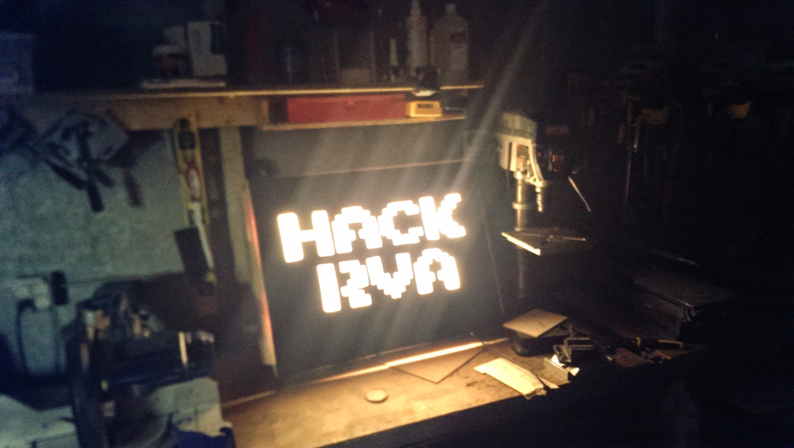
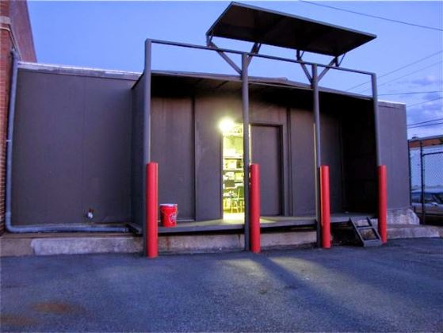
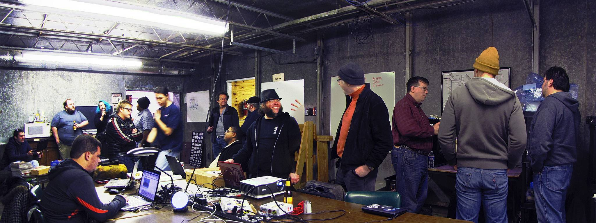
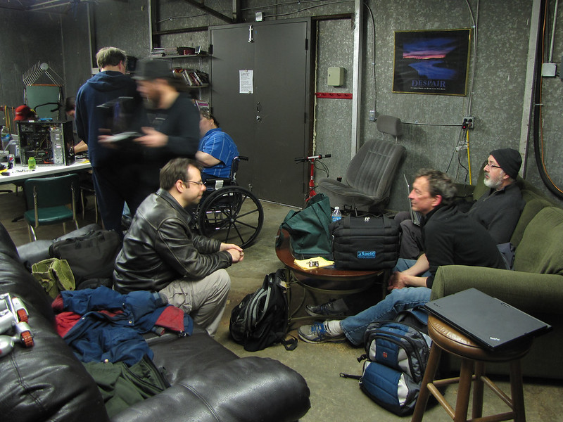
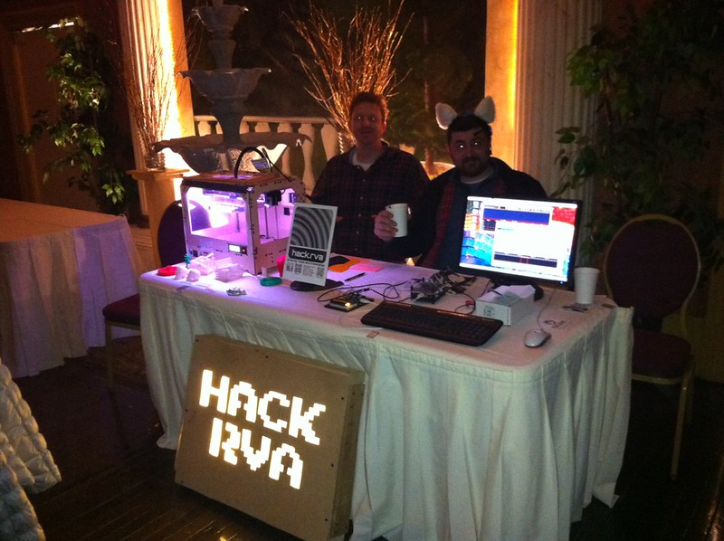
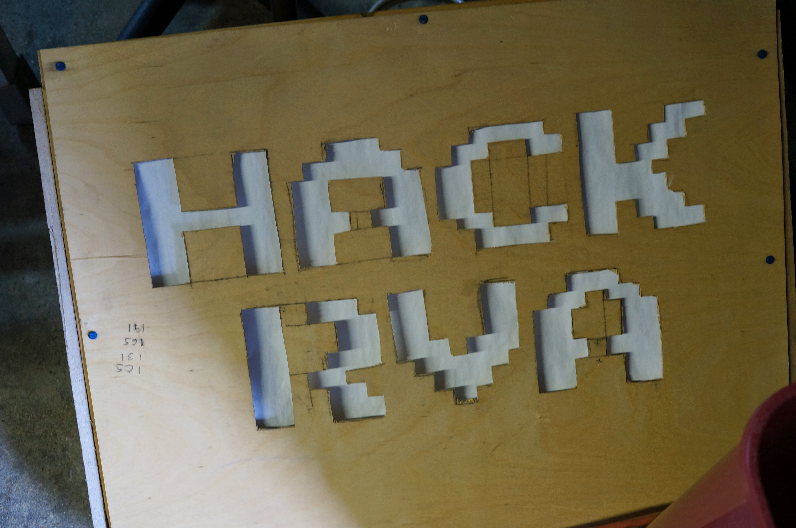

# My HackRVA Origin

## My origin story with HackRVA

In 2012, at 24 years old, I was a newly employed helpdesk fellow ready to dive into the trenches and join the fight against the uprising of computer overlords. Before this time I was somewhat of a degenerate hopping around from odd job to odd job trying to find my place in the world. Lucky enough to land low paying entry level helpdesk role, I started venturing out hoping to find avenues to grow in my newly aquired career.

After an extensive amount of internet searching, mostly relating to cyber security (I've always had some interest in the field of cyber security), I stumbled across a revolutionary concept... Hackerspaces.

### What is a Hackerspace?

> Hackerspaces are community-operated physical places, where people share their interest in tinkering with technology, meet and work on their projects, and learn from each other.
> -- [hackerspaces.org](https://hackerspaces.org/)

Funny enough, hackerspaces aren't directly related to cyber security. Aside from the fact that some members of early hackerspaces might share interest in doing cyber security related research. It's more than that though. The "hacker" in "hackerspace", at least the word of mouth definition that I've been made aware of, refers to the original meaning of the term "hacker". i.e. someone who tinkers with things, often taking something and bending it's capabilities to do something entirely different from it's original purpose.

> someone who applies ingenuity to create a clever result, called a "hack".
> -- [Tech Model Railroad Club -- MIT](http://tmrc.mit.edu/hackers-ref.html)

### Finding HackRVA

Once I learned of the concept of a hackerspace, I thought, "surely there must be one in my area". I found [hackerspaces.org](https://hackerspaces.org) and searched for a hackerspace in my hometown, Richmond, VA. Sure enough

> HackRVA is a non-profit makerspace located in Richmond, Virginia... You provide the enthusiasm and we provide the tools and community. Come visit us or become and let the joy of making begin!
> -- [hackRVA -- hackerspaces.org](https://wiki.hackerspaces.org/Hack.rva)

A freenode IRC channel was listed. So, I logged in... crickets. The IRC was dead. At least no one was currently online. I then noticed a mailing list. Click... "Welcome to the HackRVA mailing list!"

All of a sudden I was in the middle of some very interesting conversation...

> "...The good news is that the aluminum extrusions have shipped. The bad news is they won't be here by Thursday night. However, we should be good to go to build the frame a week from this Thursday!"
> -- Alan

I had so many questions. What were they building? Aluminum extrusion?

> "Those projects you sewed sound sweet, and very similar to what I'm trying to get done. Btw, here's what a dive lift bag looks like. I ave the hardware and nylon webbing too."
> -- Aaron

Dive bags? Sewing?

Next I see mention of 3D printers, servers, networks, open house... I have to go check this out.

I found the address and made plans to visit on open house.

### Open House

Even though I had the address, this place was slightly difficult to find. It's in an industrial part of town that is mostly abandoned at night and the address takes you to some other part of the property.

`1600 E Roseneath Rd, Richmond, Va 23230` gets you close, but then you have to walk around a bit to find the shenanigans. I spotted a smiley gentleman on a loading dock/porch with a Power Wheel Jeep flipped upside down. I thought, "well that looks strange... " The smiley guy waved me down and said, "Are you looking for HackRVA?" He then escorted me into "the space" (I've come to find out that some of the cool kids in the call it "the space").

It was three decent sized rooms filled with what mostly looked like trash, old tools, and people of all shapes and sizes.

It was almost as if I walked into a den of mad scientists.

People were running around assembling bits to make up weird projects. There was some sort of nefarious robot 3d printer thing running in the background with a hacked together thermal barrier made out of cardboard and overhead projector transparencies. I think I saw a guy with a hot glue gun holstered to his belt.

Talk of drones, modifying swamp boats, minecraft, cellular automatons, theoretical shapes, Linux, back alley cyborg surgery... My brain was on fire.

### I signed up

At 30 bucks a month, it was an easy decision.

When I joined there were about 30 members at HackRVA. I'm happy to note that these days the membership floats around 100-120 members (I haven't looked in a while).

I started showing up everyweek and, as per usual, I kept my head down for a while to kind of catch my bearings. However, when you are in a place where people are buzzing around working on projects. It's kind of hard to keep your head down. Eventually you catch the bug and start building things. So, I started thinking about what my first project might be. I considered that maybe I could help solve the problem of "this place is hard to find" by making a sign.

### The Sign

[Out in the wild](/blog/Out_In_The_Wild/), I spotted a mirror that was basically thrown out as trash. It was just laying in someone's yard near the curb. For some reason I thought, "I could use that to make a sign". In hindsight it doesn't make much sense, but I know the thought process I had at the time. I was vaguely familiar with the idea of lighting from my 3d animation days back at the Chesterfield Technical Center (a vocational school I went to while I was in highschool). I thought, I could reflect the light with that mirror on to something that would diffuse the light in the shape of letters.

I scooped it up and headed to HackRVA. I made my intentions known to the members who happened to be there, "I'm making a sign with this mirror". That's a crazy statement, but at a place like HackRVA, people don't tell you not to do something crazy. I proceded to build the most overbuilt sign the world had ever seen... with some help, of course. Somebody helped me put the frame together with a few 2x4s and the charismatic smiley guy from before donated some LEDs from a cabinet lighting system and taught me how to solder them.

I devised a way to get letters cut out of a piece of lauan. This consisted of projecting some letters onto the piece of wood and then cutting them out with a jigsaw (i.e. the poor man's CNC machine). I still needed something to diffuse the light. Paper! Paper would defintely diffuse the light, but it wouldn't hold up well over time. ... Perfect!

Maybe I realized that the mirror wasn't really necessary, but if I did realize it, it was too late. That mirror was securely fastened into a structurally sound box made out of 2x4s. So, what we had was a ridiculously heavy sign that you could probably drive over with a truck. Oh, and it's not really weather resistant, but we'll put it outside anyways.

It lasted longer than I thought it would hanging on the fence by HackRVA. I hope it guided a few people into the a crazy journey of making and tinkering with things.

For some reason we carried this janky little sign to events. It's not that we were proud of it. It's just that it was one of the only signs we had. Actually, maybe we were proud of it. Maybe it represented us more closely than anything we could have paid for. It was a little rough around the edges just like we were.

It even showed up in an issue of [Circuit Cellar](https://circuitcellar.com/resources/clubs/hackrva-they-provide-the-tools-you-provide-the-enthusiasm/).

What I like about this memory is that my construction skills were terrible. I had no idea what I was doing. Yet, the members of HackRVA, even though they barely knew me at the time, contributed and encouraged me to get my hands dirty and just try something and possibly fail. Anybody could have jumped at anytime and said, "that's a terrible idea", but they didn't and because they didn't, I stuck around. I failed a lot, and in those failures, I learned a lot.

Just having access to the tools, the community, and the ability to fail and fail often has contributed to my growth as a person over the years.

I guess what I'm getting at is, go make something badly and have fun.

