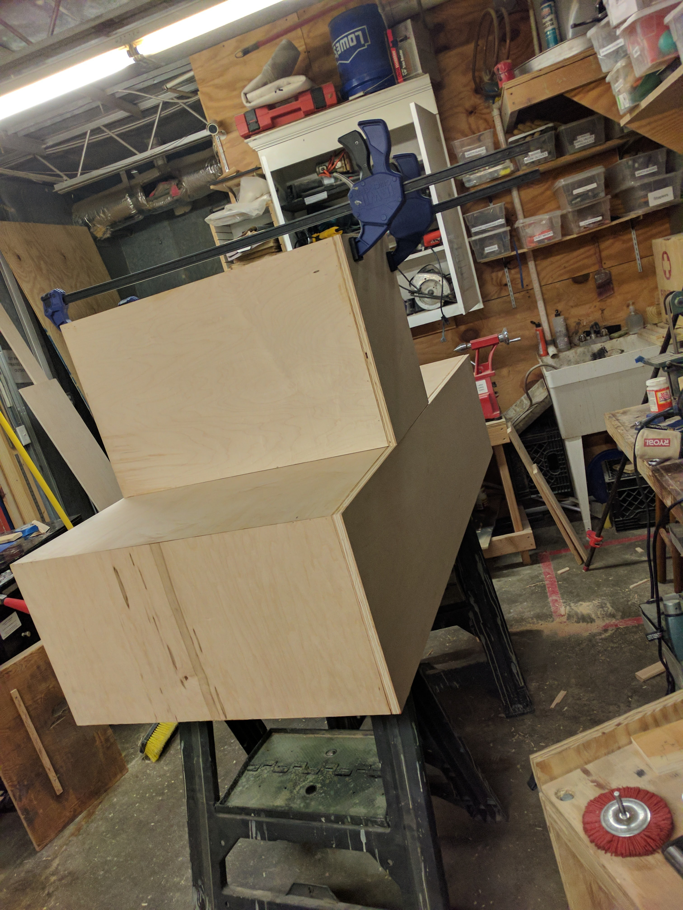
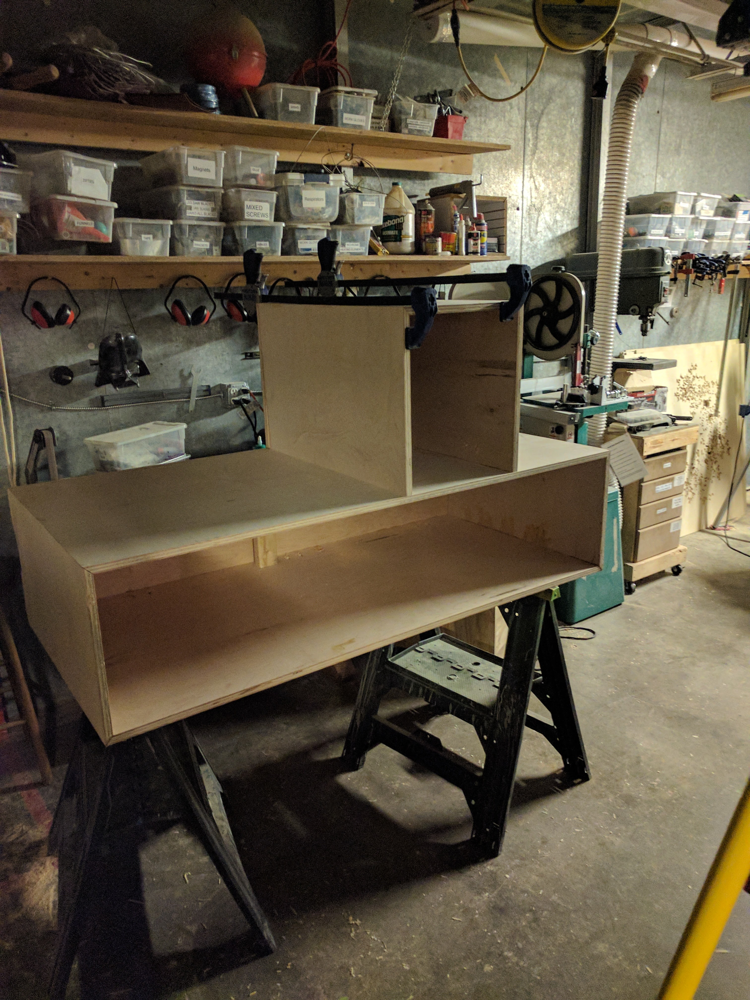
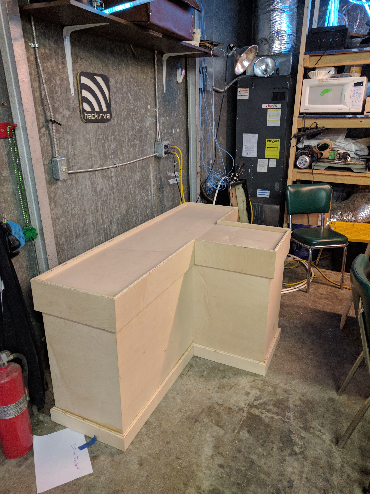
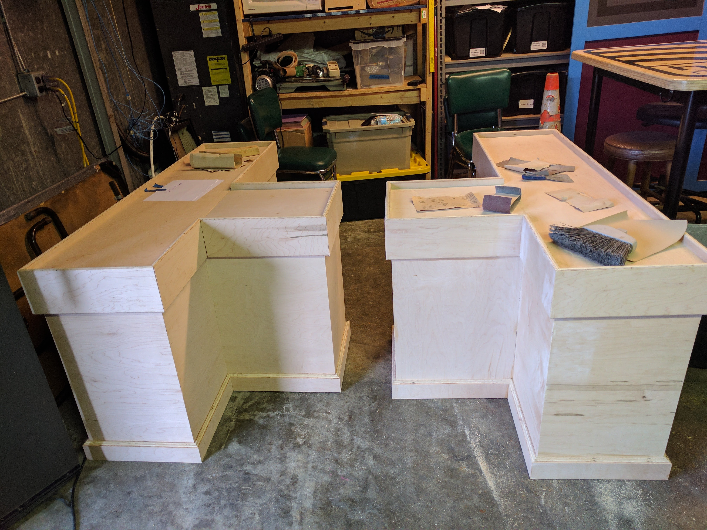
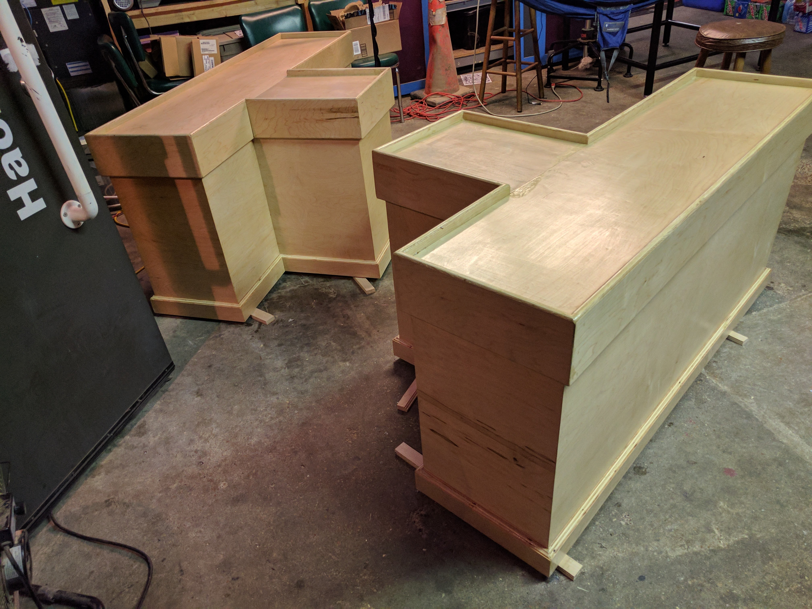
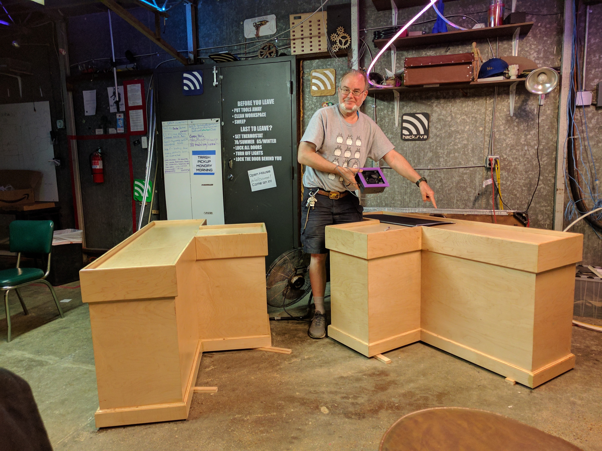
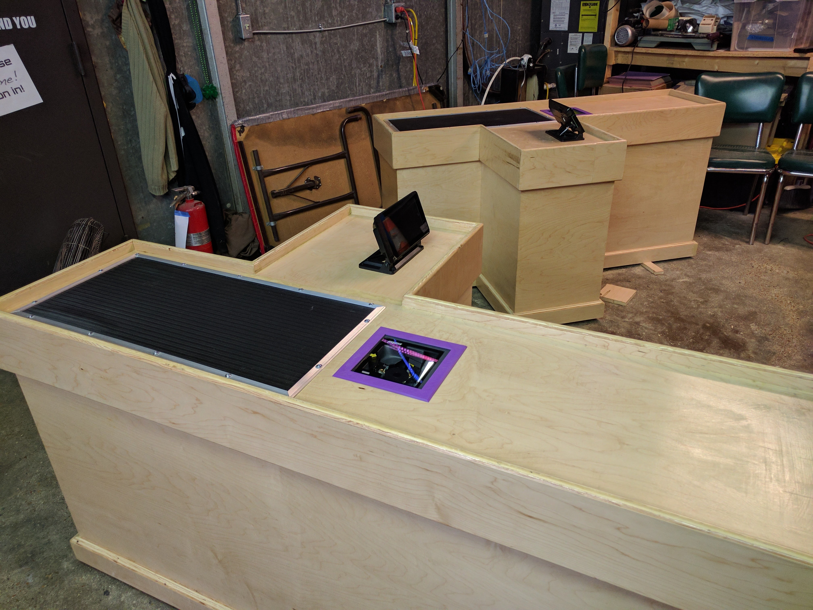
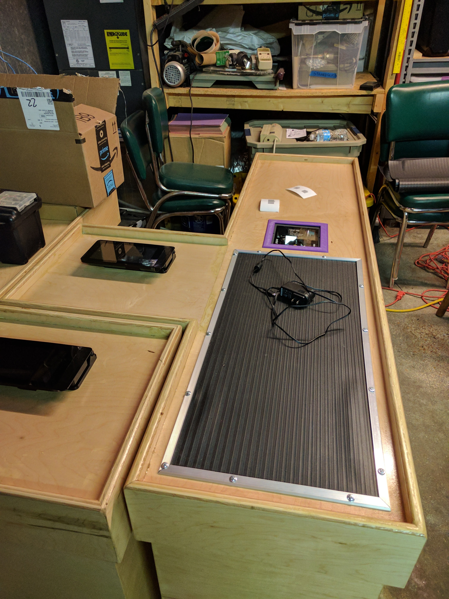
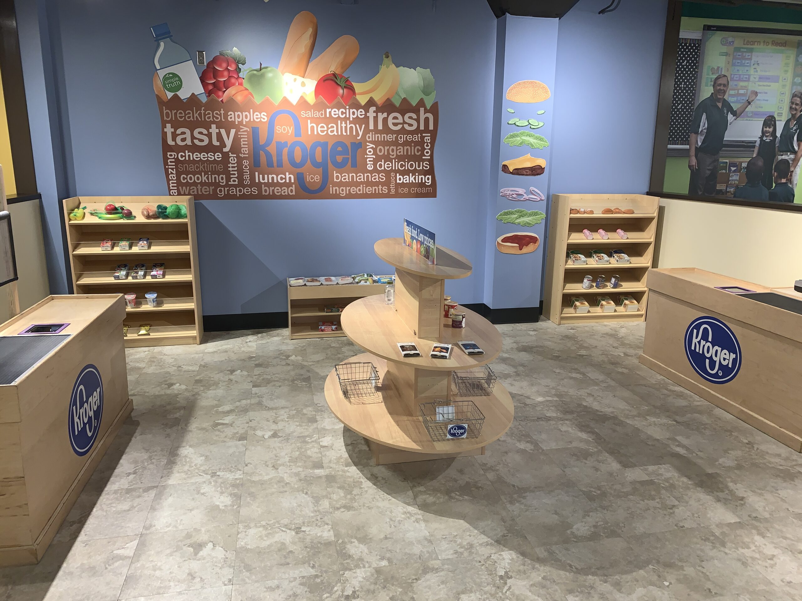
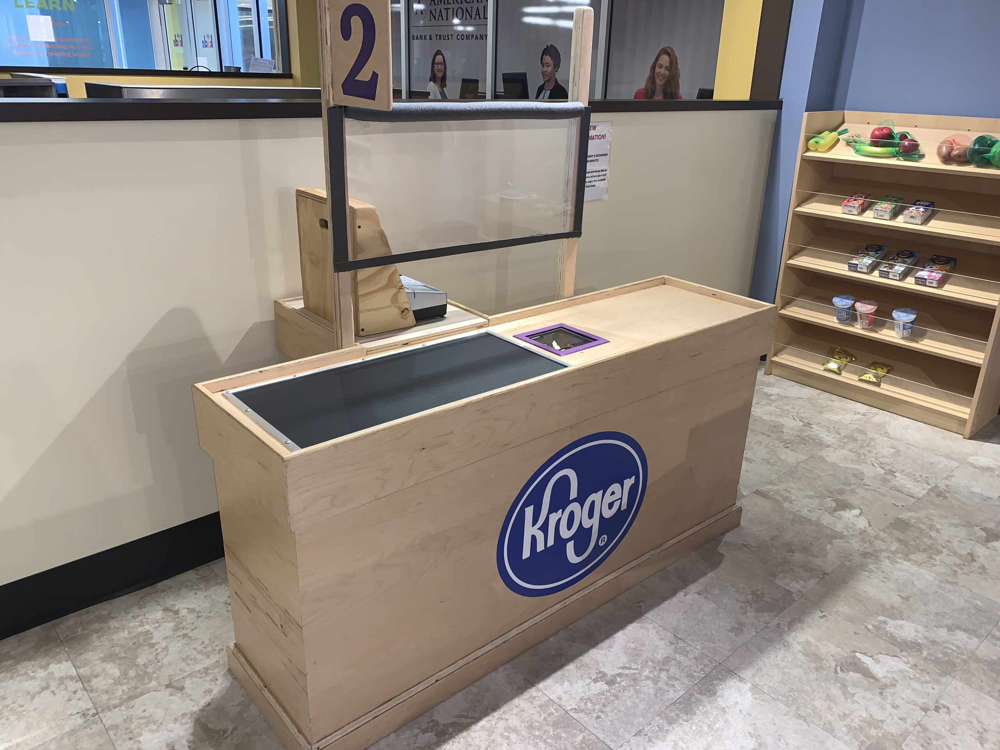

# Tiny Checkout Lines
I built these tiny checkout lines for a children's museum in Roanoke, VA.

These are standard (maple) box builds with a round-over trim and finished with several layers of poly.  The scanners (purchased from of ebay) were from real commercial checkout lines.  These scanners were each connected to a raspberry pi that had simplified software that would add up items that were scanned in.

The conveyor belts are strictly cosmetic and they do not move.

### Final setup

#### Special thanks
Many hours went into getting these things complete.
I have to think @pizzafromscratch (Bill) for keeping me company during the build and helping with sanding.  
> Check out Bill's cartoon [https://pizzafromscratch.net](pizzafromscratch.net).

Sean D. was also a big help with the software side of things.
