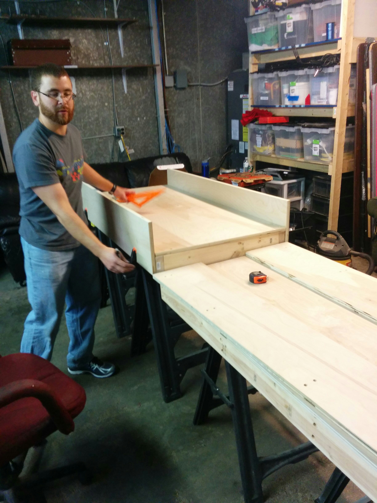
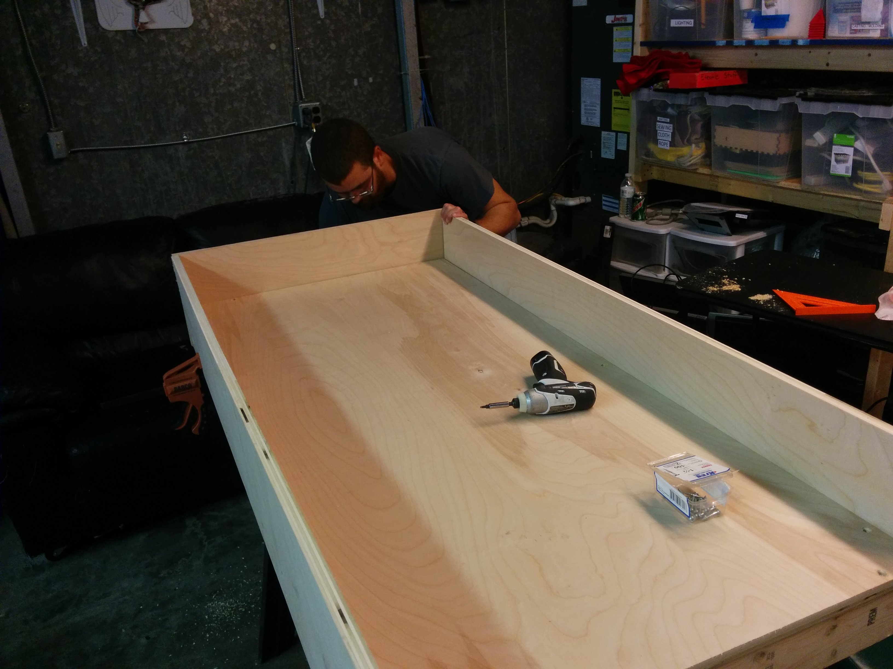
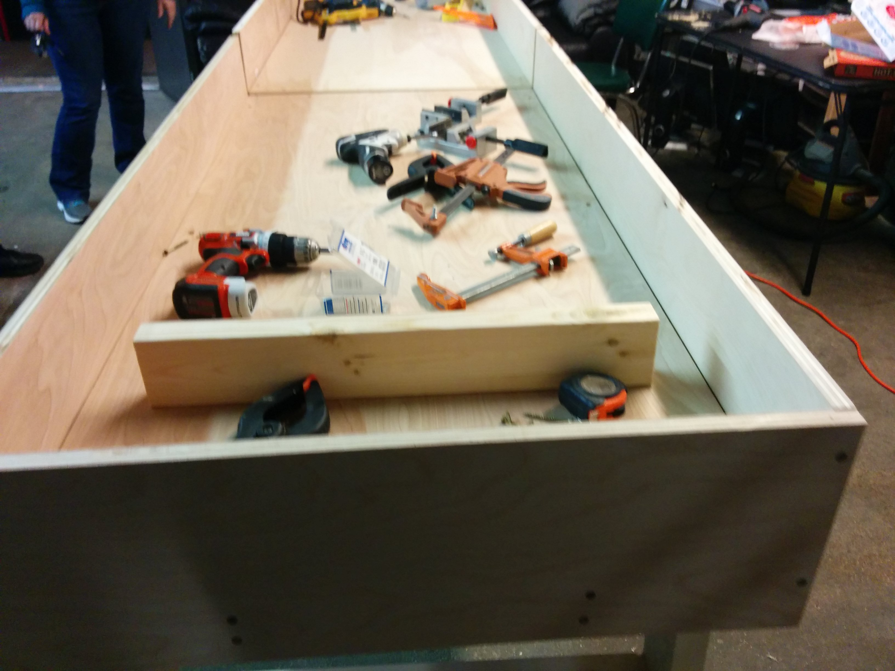
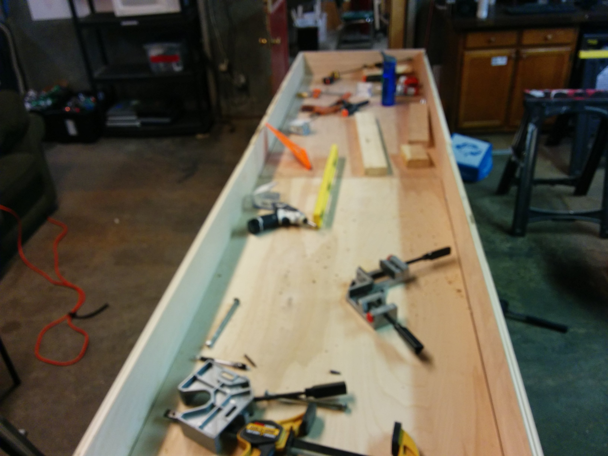
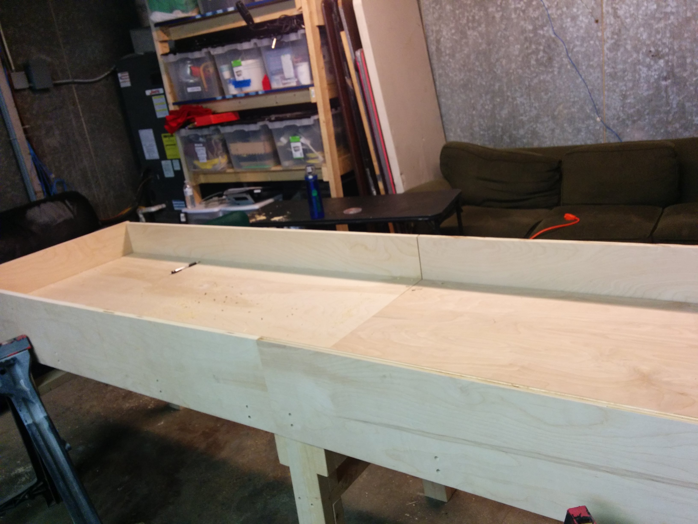
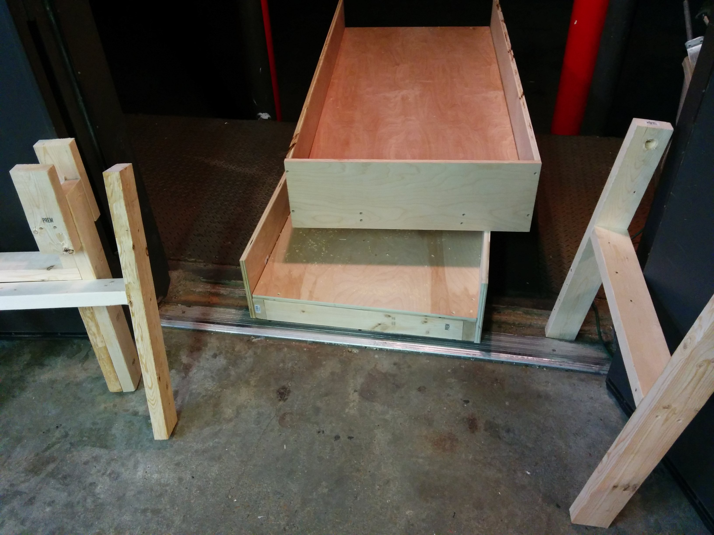

# Modular Shuffleboard Table
(Oct 2015) I built this modular shuffleboard table with my brother.
It had to be modular so that he could transport it.

It looks much nicer in his game room with the finish that he put on it.  He also added a nice top with carpeted alleys.

    
    
    
    
    
    

