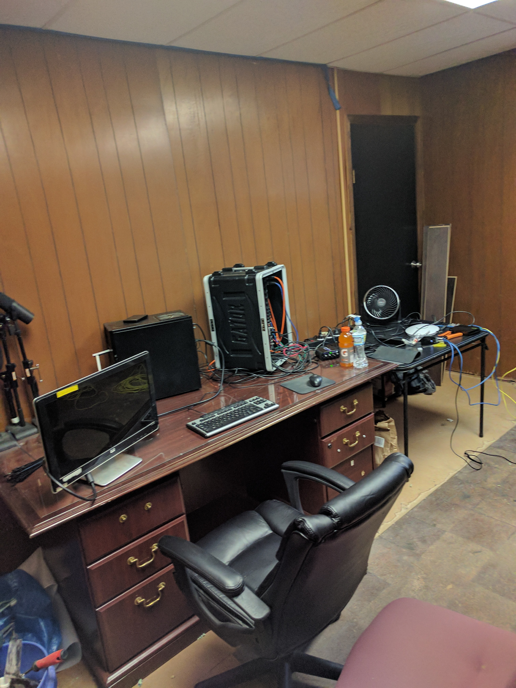
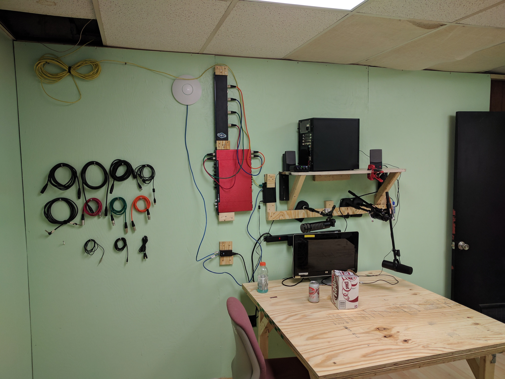
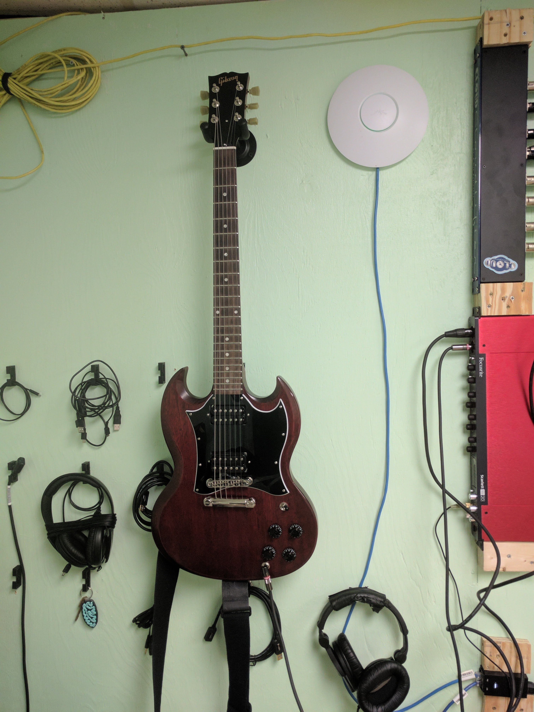

# Studio Build
For around 2 years (2017-2019), we rented a room at [RVA CreateSpace](https://www.instagram.com/rvacreate/?hl=en).

The room was pretty bad shape.

After a few trips to the big box store, we were able to clean it up.
* ripped out the old carpet
* pulled down the old wood panelling
* installed some engineered flooring
* added new walls (sheathed with [OSB](https://en.wikipedia.org/wiki/Oriented_strand_board))
    * allowed for unlimited mounting opportunities
* cheaply (and poorly) built some furniture out of sheet wood
* ran a network cable almost the entire the length of the building

It ended up being a pretty great spot for recording audio, eating lots of pizza, white-boarding out ideas, playing DnD, and naps.

#### Before

#### After

#### My Axe!

